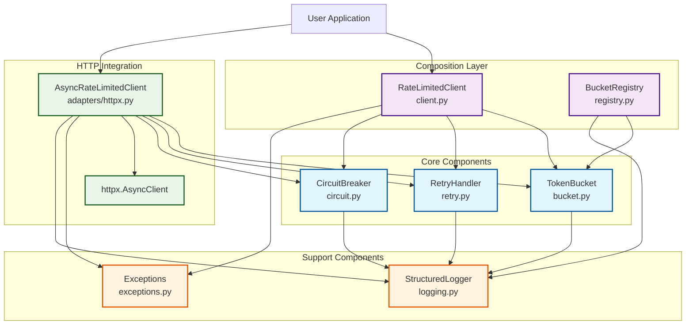
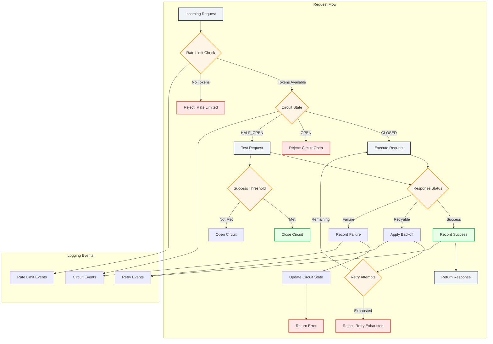
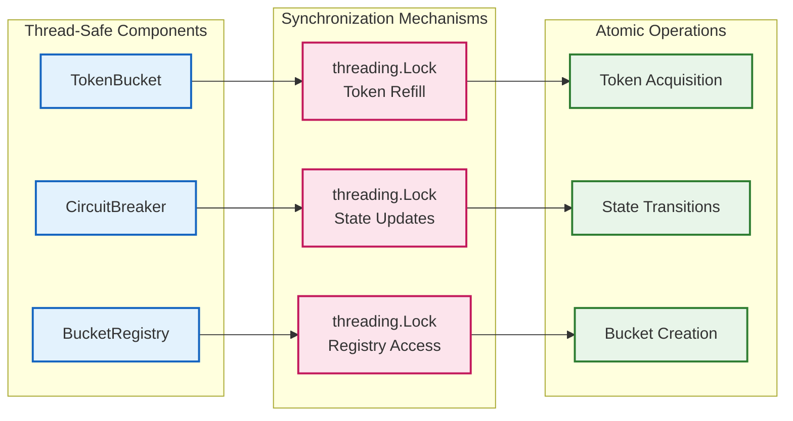
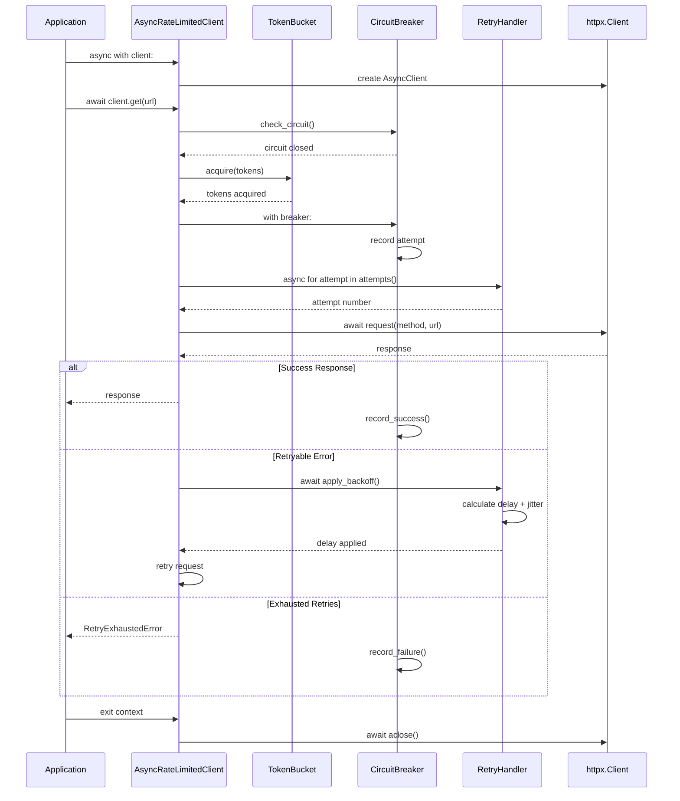

# APIGuard Architecture Overview

## Component Architecture

## Data Flow Architecture

## Thread Safety Architecture

## Async Integration Architecture

## Key Architectural Principles

### 1. **Separation of Concerns**
- Each component handles a single responsibility
- Clear interfaces between components
- Minimal coupling, maximum cohesion

### 2. **Composition over Inheritance**
- `RateLimitedClient` composes core components
- HTTPX adapter extends functionality via composition
- Flexible component combinations

### 3. **Thread Safety by Design**
- All shared state protected by locks
- Atomic operations for critical sections
- Race condition prevention

### 4. **Async-First Implementation**
- Native async/await support
- Non-blocking operations throughout
- Seamless HTTPX integration

### 5. **Observability**
- Structured JSON logging at every decision point
- Comprehensive event tracking
- Production-ready monitoring capabilities
